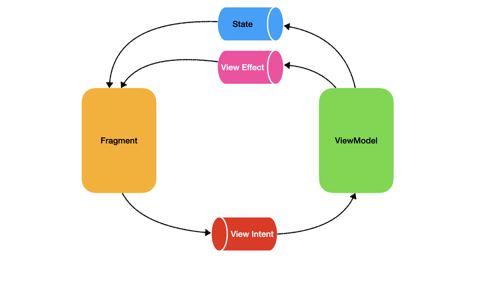

# MVI-Sample

While MVVM is one the most popular architecture among android developers, it is not perfect. The communication between ViewModel and View is a total mess. MVI architecture pattern attempts to address this issue by introducing a more organized approach. As you can see in the following picture, the only way to send an action from the view to the viewModel is through the View Intent. The ViewModel also exposes two types of observables to notify the changes to the view. 

	

* ViewIntent: The user actions that are passed to the ViewModel.
* ViewState: Represent the current state of the view at any given time.
* ViewEffect: One-time events that should not be triggered when the view is recreated